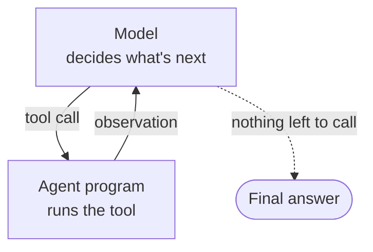

<!-- ACT 3 — THE REACT LOOP · ~16 min · 12 slides · live demo cap 3:00 -->
<!-- ⭐ THE SPINE. Largest act. Everything downstream is a consequence of mechanics introduced here. -->
<!-- Code is texture — narrate it, never walk it line by line. Mixed audience. -->

# The loop

---

# The reveal

- Everything that scrolled past in that panel was **one small loop**, running over and over.
- Not a big intelligence doing a big thing.
- A very small thing, done many times, with the result fed back in.

<!--
Here is the answer I owed you.

What you watched was not a large intelligence producing a dashboard. It was a very small loop, running maybe twenty times in a row, each pass doing one tiny step and then looking at what happened before deciding the next one.

That is the whole trick. It is almost disappointingly simple, and once you can see it you will see it everywhere — in every coding tool, every customer service bot, every "AI agent" anyone tries to sell you. Same loop underneath.

The next ten minutes take it apart. This is the centre of the talk — everything after it is a consequence of something on these slides.
-->

---
layout: two-cols
layoutClass: gap-12 narrow-cols
---

# Reason, then act

- **Thought** — what should I do next?
- **Action** — do exactly one thing.
- **Observation** — what actually happened?
- Then round again, with the observation added to what it knows.

::right::



<!--
The pattern has a name — ReAct, for reason and act — and it comes from a paper by Yao and colleagues in 2022. That is worth a beat: this is not new, and it is not proprietary. It is a published idea that everyone now builds on.

Three steps. It reasons about what to do next. It takes a single action. It observes the result. Then it goes round again, and this time the observation is part of what it is reasoning about.

The reason this is powerful is that it does not need to be right the first time. It needs to be right eventually. Each pass it gets to see reality and adjust — which is a much lower bar than planning the whole thing correctly up front, and much closer to how people actually work.
-->

---

# The whole loop is twelve lines

```python
while True:
    response = model.generate(messages=conversation)

    if response.contains_tool_call():
        tool_call = response.get_tool_call()

        result = execute_tool(tool_call.name, tool_call.arguments)

        conversation.append(response)
        conversation.append({"role": "tool", "content": result})
    else:
        return response.message
```

Ask the model. If it asked for something, do it and hand back the result. Otherwise, you're done.

<!--
For the non-technical half of the room: you do not need to read this. Look at the shape of it. It is short, and it is a loop.

In English — ask the model what to do. If it asked to use something, use it, and add the result to the conversation. If it did not ask for anything, it is finished, so stop.

That is genuinely it. That is the engine under every agent you have heard about. Not a metaphor or a simplification I am giving you because you are not engineers — engineers, this is the real structure, it is just missing the error handling.

The two things worth noticing. Everything gets appended to that one growing conversation — remember what I said about the transcript, we are about to pay for that. And the loop stops when the model stops asking for things, meaning the model decides when it is done. Nobody told it twenty steps.
-->

---
layout: two-cols
layoutClass: gap-8 narrow-cols
---

# What goes in

```json
{
  "messages": [
    { "role": "user",
      "content": "What's the weather
                  in Toronto?" }
  ],
  "tools": [{
    "name": "get_weather",
    "description": "Get current weather",
    "parameters": { "city": "string" }
  }]
}
```

::right::

# What comes back

```json
{
  "role": "assistant",
  "tool_calls": [{
    "name": "get_weather",
    "arguments": { "city": "Toronto" }
  }]
}
```

It didn't answer. It asked for something — by name.

<!--
One slide of this, then we are done with code entirely. Do not read it out. Point at the shape.

Left: what gets sent. A question, and a list of what is available — here, one thing that can look up weather, with a description of what it does and what it needs.

Right: what comes back. And this is the moment — it did not answer the question. It could not. It has no weather in it. What it produced was a request: use this specific thing, with this specific input.

That is the whole mechanism. The model never does anything. It writes down what it would like done, in a format ordinary code can read, and then something else does it and hands back the answer. Then round the loop again, and this time it has the weather and can answer properly.

Every single tool call you have ever seen — searching the web, reading a file, sending an email, drawing the dashboard you watched — is exactly this. A name and some arguments.
-->

---

# The model never drew anything

- In that first demo, it emitted requests: *add a section*, *set this chart*, *change that colour*.
- Ordinary, boring, deterministic code did every single one of them.
- **Model proposes. Harness disposes.**
- Which means the risky part is not the model. It's what you let it ask for.

<!--
Back to the dashboard, because this is the idea I most want to survive the evening.

The model did not draw anything. It cannot draw. What it produced was a sequence of requests — add a section, put a chart here, make it green — and plain ordinary code, written by hand and entirely predictable, carried each one out.

Model proposes, harness disposes. The intelligence suggests; the machinery decides what is actually permitted and does it.

And that has a consequence worth sitting with, because it is the answer to "how do you let one of these things loose safely." You are not trying to make the model trustworthy. You are choosing what it is allowed to ask for. A model that can only request four drawing operations cannot do anything worse than draw an ugly dashboard.

Every serious safety question about agents is really this question. What is on the list.
-->

---

# A tool is a function with a description

- A name, a description in plain English, and a list of inputs.
- The model never sees the code. It only ever sees the **description**.
- So the description is a prompt — and a vague one gets it used wrong.
- Give it a bad list of tools and no model, however good, can save it.

<!--
So what is a tool. Almost nothing. A name, a plain-English description of what it does, and what it needs to be given.

Here is the part people get wrong. The model never sees how the tool works. It only sees the description. So that description is not documentation — it is an instruction, and it is the only thing standing between the model and using the thing wrong.

Which means most "the AI is being stupid" problems are actually design problems. Vague description, badly chosen set of tools, two that overlap so it cannot tell which one you meant. No model is good enough to rescue a bad list.

If you ever build one of these: the tool descriptions are the product. Everyone spends their time on the prompt and then wonders why it keeps picking the wrong thing.
-->

---

# So that’s what an “agent” is

- You have all heard the word. Almost nobody says what it means.
- **An agent is a program that runs this loop.** That is the entire definition.
- A loop, a list of tools, and a goal. Everything else is packaging.
- So when someone sells you an “AI agent,” the useful question is: **what's on its tool list?**

<!--
This is the vocabulary slide, and for this room it may be the most useful one in the act.

Nobody outside this field talks about loops. They talk about agents — it is the word in every headline, every product announcement, every post any of you have scrolled past this year. And almost nobody ever says what it means, which leaves people assuming it is something mysterious.

So let me close the gap. An agent is a program that runs the loop you have been looking at for the last ten minutes. That is the whole definition. A loop, a list of tools it is allowed to call, and a goal. Everything else — the branding, the personality, the name somebody gave it — is packaging around those three things.

You already understood agents. You just did not know that was what they were called, because we did the mechanism first and the vocabulary second. That is deliberate — hearing the word first would have left you with a label and no picture.

And it hands you a question worth keeping. When somebody sells you, or your employer, an AI agent, the question is not how clever is it. It is: what is on its tool list, and who decided what goes on it? Something that can only read is safe. Something that can send email on your behalf is an entirely different proposition, and it is the same technology.

That is also the answer to "how do you let one of these loose safely" — and you now know enough to ask it.
-->


---

# Watch it decide

- Same demo. Same panel. This time you know what you're looking at.
- One deliberately ambiguous request — and watch it *refuse to guess*.

<!--
🔴 LIVE — react-loop-demo · HARD CAP 3:00

Same app, panel open, but now narrate against the vocabulary they have. Point at the actual words as they scroll: there is the request, there is the tool call, there is the result coming back, and now round again.

Then the ambiguous prompt: "show my checking balance." Two checking accounts exist.

What should happen is that it calls a tool whose only job is to ask the user a question. Draw that out — the honest thing was not to produce an answer, it was to stop. That is a tool call like any other. Asking a question is an action.

If it guesses instead of asking, do not hide it. Say so, and say why: it is a probabilistic system and this is exactly the failure mode we manage. That is a more honest talk than one where the demo always works.

Three minutes. Then stop, whatever is on screen.
-->

---

# Why there's a context limit

- The loop re-sends the **entire** conversation, every single pass.
- Turn twenty is re-reading turns one through nineteen. Again.
- So it grows — and what you're running out of is the transcript, not the intelligence.
- Longer conversation, slower and more expensive every turn.

<!--
Now we collect on the promise from the primer, and this is where all the jargon you have half-heard starts to mean something.

The model remembers nothing. So for the loop to work at all, every pass has to re-send the entire conversation from the beginning. Pass twenty re-sends everything from passes one through nineteen, plus every tool result along the way.

The pile only grows. Which explains three things people find mysterious. There is a limit — that is the context window, and it is a limit on the transcript, not on how clever it is. It gets slower and more expensive as you go, because you are re-sending more each time. And a long session eventually feels sluggish and vague in a way a fresh one does not.

You are not running out of intelligence. You are running out of room.
-->

---

# Why it forgets in the middle of a task

- Eventually the transcript stops fitting.
- So something summarises it to make room — that's compaction.
- **A summary is lossy by definition.** Something you cared about may not survive it.
- The fix isn't a bigger window. It's putting less in, and starting fresh sooner.

<!--
So what happens when the pile stops fitting. Something has to give, and what gives is the older part of the conversation — it gets summarised down to make room. That is compaction, and it happens automatically, usually without telling you.

And a summary loses things. That is not a bug, that is what a summary is. Some detail you mentioned an hour ago and considered settled does not survive, and the thing carries on confidently without it. That is the real explanation for the experience of it going strangely off the rails deep into a long task.

Two responses, and neither is "wait for bigger windows." Put less in to begin with. And when you notice drift, do not fight it — summarise the state yourself, deliberately, and start a clean session where you control what carries over.

That is the first genuinely practical thing in this talk, and the whole of the next act is more of it.
-->

---

# The memory wall

- Close the session and everything is gone. Every time. Every tool.
- It relearns your project, your preferences, your standards — from scratch, daily.
- The workarounds are everywhere: brain files, memory servers, knowledge graphs.
- A meaningful share of what people build is just this — elaborate compensation for forgetting.

<!--
Now the bigger version of the same problem, and this one is unsolved industry-wide.

Everything so far was about one conversation. But close it, and all of it is gone. Not compacted — gone. Tomorrow it does not know your project, your preferences, the standard you spent an hour establishing, or the thing you told it three times not to do.

Someone reviewing a large pile of agent projects observed that a meaningful number of them were, underneath, elaborate workarounds for agents forgetting everything between sessions. Fifty-odd markdown files acting as a brain. Shared memory servers. Knowledge graphs. Plain text files passed hand to hand.

Everyone hit the same wall and everyone improvised their own scaffolding. That is where the field actually is, under the marketing.

Hold that thought, because there is a real answer taking shape and I will come back to it. And notice what all those workarounds have in common — they are all just writing things down. That turns out to matter more than it sounds.
-->

---

# Everything after this is loop management

- Prompts, planning, sessions, skills, memory, scripts, model choice.
- Every one of them is the same question: **what goes in the transcript, and when?**
- You now have the whole mechanism. The rest is technique.

<!--
Last slide of the act, and it is a hinge.

Everything you have heard about — prompt engineering, planning modes, memory, skills, context management, when to start a new chat, which model to pick — is not a list of separate topics. Every single one is a way of controlling what goes into that transcript and when.

That is why we did the loop first. If I had opened with context windows it would have been a number. Now it is the reason your conversation slowed down, the reason it forgot, and the reason the next act works.

You have the mechanism. There is nothing else structural to learn. The rest is technique — and the next fourteen minutes are the techniques that actually pay.
-->
