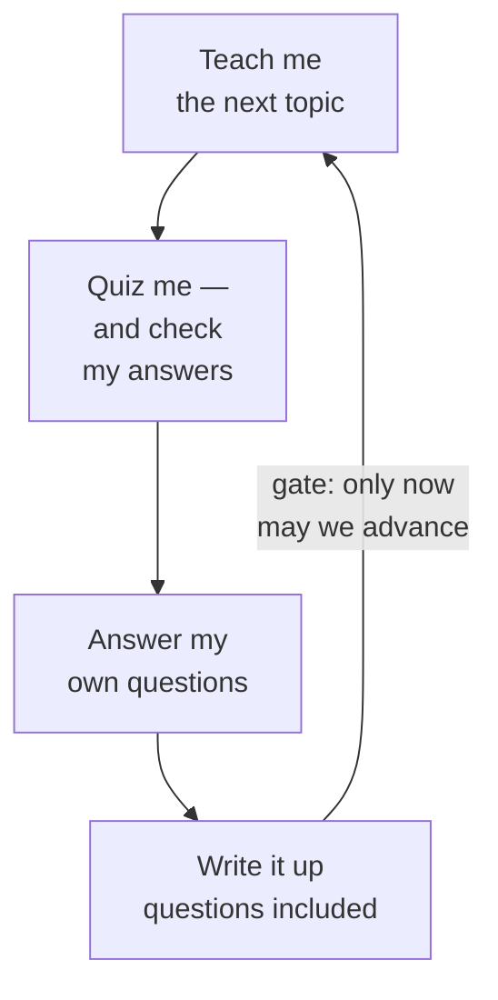

<!-- ACT 4 — WORKING EFFECTIVELY · 14 min · 11 slides · no demo -->
<!-- The practical take-home act. De-jargoned from source 06-determinism / 07-context-management / 09-metacognition. -->
<!-- Ends on meta-learning by design — that hands Act 7 a method instead of an exhortation. -->

# Working with it well

---

# You're not writing prompts — you're managing a transcript

- The loop re-sends everything, every turn. So the transcript *is* the product.
- Every technique that follows is one question: what earns its place in there?
- "Prompt engineering" undersells it. This is closer to editing.

<!--
This is the practical act — the one with things you can do on Monday. And all of it hangs off the fact we established a moment ago: the whole transcript goes back in, every turn.

So stop thinking of it as writing a clever instruction. The instruction is a small part. What actually determines the output is everything that has accumulated in that window — the good, the stale, the abandoned wrong turn from ten minutes ago that is still sitting there quietly poisoning things.

The skill is curation. Nine slides of it, then something better at the end.
-->

---

# Plan first, execute second

- Do the thinking in one session. Do the work in another.
- A plan is just a very well-structured prompt.
- Planning is where you find out you asked for the wrong thing — cheap there, expensive later.

<!--
The single highest-leverage habit, and it costs nothing.

Separate the conversation where you work out what should happen from the conversation where it happens. Two reasons. First, the thinking is messy and long, and you do not want that mess competing for room with the actual work. Second, a plan you have read and corrected is a far better instruction than anything you would have typed off the cuff.

There is a third reason that matters more than either. Planning is where you discover you asked for the wrong thing. Finding that out during a five-minute conversation is free. Finding it out after everything has been built is not.

For a non-technical audience the same thing holds for any big ask — a trip, a letter, a decision. Argue about the shape of it first, in its own conversation.
-->

---

# Start over more often than feels natural

- Sessions drift. Old context outlives its usefulness and starts doing harm.
- Closing one is cheaper than fighting it.
- One session, one task. When the task changes, the session should too.

<!--
People are strangely reluctant to do this — a long chat feels like an investment, like you would be throwing away rapport. There is no rapport. There is only a transcript, and half of it is now working against you.

Watch for the tell: it starts making mistakes it was not making an hour ago, or keeps dragging back a detail you have already moved past. That is not the model degrading. That is your transcript.

Carry forward a short summary you write yourself, and open a fresh one. Almost every "it got dumber" story I hear is really a session that should have been closed twenty minutes earlier.
-->

---

# Don't hand it everything — tell it what exists

- Dumping everything in does not help. Signal drowns in noise.
- Give it a map, and let it ask for the territory.
- Load what the task needs, when the task needs it.

<!--
The instinct is that more context is better. It is not. Everything you put in competes for attention with everything else, and past a point you are actively burying the part that mattered.

The better move is to describe what is available and let it request what it needs. Give it the shape of the whole thing and the ability to pull in the specific piece. It asks better questions than you would guess, because it knows what it is missing and you do not.

The general version, and it applies to your notes as much as to a codebase: organise so a stranger could find the relevant part without reading all of it. That is the same work.
-->

---

# Consistency in, consistency out

- Your conventions are an instruction, whether or not you meant them to be.
- It imitates what it finds. Tidy in, tidy out — and the reverse.
- Free leverage: fix the pattern once, get it applied everywhere after.

<!--
This one surprises people. The model reads the surroundings and copies the local style — naming, structure, how things are laid out. So your existing material is a prompt you never consciously wrote.

Which cuts both ways. A consistent starting point steers every future request for free. An inconsistent one means you are fighting your own history on every single task, and losing.

Non-technical version: if your documents follow a shape, anything it writes for you will follow that shape too. Establishing the shape once pays out every time after.
-->

---

# Script the parts that repeat

- If a script can do it, a script should do it.
- Same answer every time, instantly, for free.
- Best use of the model: have it *write* the script, then stop calling it.

<!--
There is a trap where, having found a tool that can do anything, you route everything through it. Do not. Anywhere the job is genuinely mechanical, ordinary code is better on every axis — faster, free, and identical every time you run it, which the model is not and never will be.

The move is to use inference to produce the script, once, and then just run the script forever. You spend the expensive, creative, unpredictable thing on the part that is actually creative, and let boring reliable code handle the boring reliable part.

Keep the unpredictability where it earns its keep.
-->

---

# Which model should I use?

- The only version of this question that matters in practice.
- Big model for judgment, taste, and anything ambiguous.
- Small, cheap, fast model for volume and well-defined work.
- Genuinely good pattern: small model does it, big model checks it.

<!--
This is where parameters and reasoning modes and all the model trivia would normally go. Skip all of it. The practical question is just: which one do I point at this task?

Roughly — the expensive one for judgment, ambiguity, anything where being wrong is costly and you need it to notice its own uncertainty. The cheap fast one for volume and for work you have already specified tightly.

The pattern worth stealing comes from an engineer at AWS who builds these systems: let the small model do the work and the big model review it. You spend frontier money only on the judgment step, which is the step that actually needed it.

And keep it swappable. These change every few months and you do not want to be married to one.
-->

---

# Same model, very different results

- Every tool wraps the model in instructions you never see.
- Identical model, different wrapper, genuinely different behaviour.
- So "which AI is best" is the wrong question. Ask what it is set up to do.

<!--
Underrated, and it explains a lot of contradictory experiences.

The same underlying model behaves quite differently in a coding tool, a chat window, and something embedded in your email — because each one wraps it in its own hidden instructions about what to prioritise, how carefully to work, when to ask versus assume.

So when someone tells you a model is brilliant and someone else says it is useless, they may both be right and simply be using different wrappers around the same thing.

Pick for the job, not the badge. And know that when a tool feels wrong, the wrapper is often what is wrong, not the intelligence underneath it.
-->

---

# The 17% problem

- Controlled trial, Anthropic, January 2026: AI-assisted group scored **17% lower** on mastery.
- Tested minutes after finishing. Biggest gap: debugging.
- **The exception is the whole finding.** Those who asked *why* scored as well as the group with no AI at all.

<!--
Now the uncomfortable part, and the reason the rest of this act is not enough on its own.

Anthropic ran a proper randomised trial. The group using AI finished their work and then scored seventeen percent lower on understanding what they had just produced — quizzed minutes later, on their own work. Nearly two letter grades. Worst gap in debugging, which is exactly the skill you need when it goes wrong.

Here is the part everyone skips. Not everyone in that group did badly. The people who used it to ask conceptual questions — why does this work, explain this to me — scored just as well as the people who had no AI at all. Same tool, same time, opposite outcome. What separated them was not ability. It was what they asked for.

That is a finding, though. It tells you which group to be in and nothing about how to get there. So the last two slides are the method.
-->

---

# The roadmap that teaches you

- Everyone's instinct: *ask it to write the document, then read the document.*
- This does the exact reverse.
- One file holds the syllabus and a status column. Nothing is written up front.
- It teaches you a topic in conversation — then quizzes you, and checks your answers.

<!--
This is the best single idea I have to give you, it costs nothing, and it works for absolutely any subject.

You keep one file. It lists what you are trying to learn, in an order where each thing builds on the last, and it carries a status column — not started, covered. That file is the whole system.

You do not ask for a summary. You say: teach me the first one. It explains, in conversation, back and forth, and you interrupt as much as you like. Then it asks you comprehension questions — and, crucially, checks whether your answers were actually right rather than politely accepting them. Then it asks what you are still unsure about, and answers that too.

Only after all of that does anything get written down. Which brings us to the trick.
-->

---

---
layout: two-cols
layoutClass: gap-12
---

# Writing it up is how you advance

- The write-up is the **gate**: no document, no next topic.
- So the summarising step can't be skipped — and that step *is* the learning.
- It must capture *the questions you actually asked*, not just the planned material.
- The document is a **byproduct** of understanding, not a substitute for it.

::right::

<!--
Here is the mechanism that makes it work rather than just sound nice.

Writing the document is a prerequisite for moving on. Not encouraged — required. And that matters because summarising what you just learned is precisely the step that produces the learning, and precisely the step everybody skips when they are in a hurry.

Second detail, and this is the one I would underline. The document has to capture the clarifying questions that came up during the session — not just the material that was planned. Those questions are the most valuable thing in the room, because they are the exact shape of what *you* did not understand. A generic explainer cannot contain them. Yours does.

So the document ends up being about your understanding rather than about the topic. It is a byproduct of having learned, not a replacement for learning.

Notice what this is, structurally. It is the same loop from Act 3 — do a thing, check the result, write down what changed, go again — pointed at a person instead of at a task.

You will find both of these written up properly, and free, at the link on the last slide.
-->
