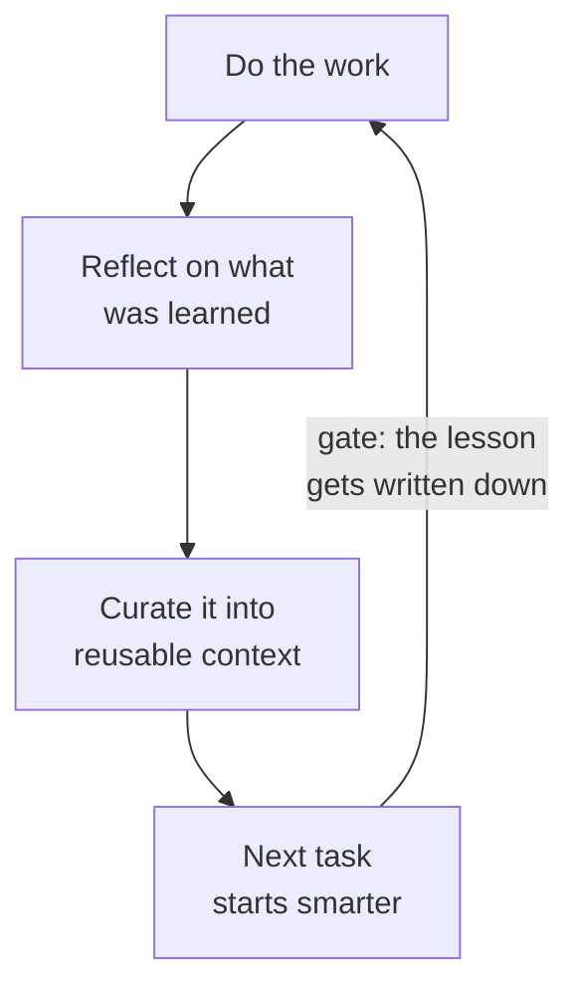

<!-- ACT 5 — SHOW AND TELL · ~10 min · 7 slides · live demo cap 4:00 -->
<!-- Every slide stands alone — no repo links, nothing to go read afterward. Both projects stay private. -->
<!-- ⚠️ No triumphalism. Some of this room is worried about their job. -->

# Show and tell

---

# This deck is the demo

- I promised you this at the start.
- **1,100 notes. Around half a million words.** Projects, retrospectives, book highlights, half-finished thoughts.
- An agent read across all of it and assembled what you have been looking at for the last hour.
- Including things I did not remember I believed.

<!--
Here is the bookend from the first ten minutes.

This presentation was not written the normal way. I pointed an agent at my own notes — about eleven hundred of them, something like half a million words, which is six novels' worth of me talking to myself — and asked it to build a talk out of what was in there. Projects, retrospectives from things that went badly, book highlights, half-finished thoughts.

The structure you have been sitting through is the result. It found the connection between a study I saved in March and a closing argument I wrote in July, which I had never consciously connected myself.

I want to be precise, because this is the part that gets oversold. It did not have ideas. Every idea in this room is one I had already had, written down somewhere and mostly forgotten. What it did was read all of it at once — which I cannot do — and notice what went together.

That is a real distinction, and it is the entire reason this next part is worth your attention.
-->

---

# Your notes are the context window

- I didn't start this for AI. I started it because I was **drowning in context switching** at work.
- I wanted one place that kept me grounded and told me where I was. So I picked a system and stuck to it.
- Two years later, that habit had quietly built something an agent could read end to end.
- **The corpus was a side effect.** Most of you already have some version of it.

<!--
This is the slide for those of you who will never write a line of code, and I think it is the most useful thing I have to say tonight.

Be honest about why this exists, because the accident is the whole point. I did not start keeping notes because I thought an AI would one day read them. I started because my job had me switching context constantly — different projects, different problems, picked up and put down a dozen times a day — and I could not hold it in my head. I wanted one place that kept me grounded and told me where I was.

So I set up a system properly: a standard format for daily notes, a consistent way of filing things so I could find them again. Entirely for me. Entirely about staying on top of work.

Two years of that turned out to have built something else without my noticing — a body of writing about how I actually think and work, in my own words, that an agent can read end to end. The corpus was a side effect of the habit.

That is the part I want you to take, and notice how low the bar is. Nobody has to design this, and you do not need a reason that has anything to do with AI. The reason most people already have is the one I had: there is too much going on to keep in your head.

Which also flips the usual question. People ask me which AI to use. Much more of the answer is: what have you got for it to read? Two people with the identical tool get wildly different results based entirely on what they can hand it.

You all have a version of this. Notes, documents, photos, email, the family records somebody has been quietly maintaining for twenty years. That is the raw ingredient.
-->

---

# Ask it something

- Live, against the actual notes. Not a rehearsed answer.

<!--
🔴 LIVE — vault demo · HARD CAP 4:00

⚠️ Query is chosen in advance and rehearsed — the vault holds work material and personal notes. Do not free-range. Do not take a suggested query from the room; say plainly that there is private material in here and that is exactly why the query is prepared.

Show the shape of it: it searches, reads a few files, follows a reference into another note, and answers with citations back to where it found things.

Point out the loop while it runs. That is a tool call. That is an observation. Same twelve lines from Act 3, pointed at a folder of text files instead of a dashboard.

The beat to land: it is not doing anything clever. It is reading, quickly, across more material than I could hold in my head at once. The intelligence is ordinary. The corpus is what is rare.

Four minutes. Stop when it is up.
-->

---

# The cost of not writing it down

- Every session starts from zero: who you are, how you work, what you already decided.
- Explain it again. And again. Every conversation, every tool, forever.
- Call it the **context repetition tax** — small each time, enormous in aggregate.
- Pay it daily, or pay it once by writing things down.
- **Skills, agent definitions, brain files, my notes — every one of them is the same move.**

<!--
Here is the flip side of the memory wall, in terms that apply to everybody.

Every conversation starts from nothing. It does not know who you are, how you like things done, what you decided last week, what you have already tried and rejected. So you explain. And the next day you explain again. And when you change tools you explain from scratch.

Someone gave that a name — the context repetition tax. Trivial each time, enormous over a year.

You pay it in one of two ways. Daily, in small instalments, forever. Or once, by writing the thing down somewhere it can be read again.

Now pull the whole evening together, because this is the second spine of the talk and it has been running underneath everything.

The skills and agent definitions from the last act? That is this. The elaborate workarounds from the memory wall — fifty markdown brain files, memory servers, knowledge graphs? That is this. The learning technique where you cannot advance until the document exists? That is this. My notes, which is what you are looking at? Also this.

Every one of them is somebody paying the tax once instead of daily. The industry spent two years and a great deal of money converging on the same answer your grandmother would have given you: write it down.

That is worth saying plainly, because it is the one piece of advice in this talk that needs no technology at all and does not expire when the models change.

Keep it in plain text, keep it in pieces rather than one enormous document, and keep it current. That is genuinely the whole method.
-->

---

# The dashboard, as a project

- The thing from the opening five minutes: describe a dashboard, watch it get built.
- The dashboard is the hook. **The debug panel is the actual product.**
- Deliberately small: a hand-written loop, no framework, heavily commented.
- Built to be *read*, not to be used. It exists to make one idea visible.

<!--
Briefly, the thing you opened on — because there is a point in how it is built, not just what it does.

The dashboard is the hook. The debug panel is the real product. That panel is why the thing exists: every request, every thought, every tool call, every result, and what it all cost, on screen while it happens.

Most tools hide all of that. Reasonable for a product, useless for understanding. And I think the hiding is a large part of why this technology feels like magic to people, and therefore either miraculous or threatening. Very little of that survives watching the machinery for five minutes.

Under it is the same loop from Act 3, written by hand — no framework — and commented heavily, because the loop is the lesson. It is a teaching object. It is not on the internet and there is nothing to click; you have seen the interesting part already, which was the panel.
-->

---
layout: default
class: refs
---

# The ones I didn't show you

- **Math Recall** — drills times tables. Built because my kids needed one.
- **SafeSpend** — tells me what I can actually spend this month, from my own budget data.
- **Game server manager** — spins a server up and down so nobody has to ask me.
- **Task Picker** — reads my notes and tells me what to do next.
- **RepoX-Ray** — reads a codebase's history and reports how it really gets worked on.
- **Agent Orchestrator** — agents that pick up a ticket and open a pull request, unattended.
- **Homelab GitOps** — the servers in my house, defined as code so I can rebuild them from scratch.

**Every one of these was built in the last twelve months.** Ask me about any of them afterwards.

<!--
Thirty seconds. Do not walk through them — the length of the list is the point, not the contents.

The top two are the ones for this room. Math Recall exists because my kids needed to drill times tables and the apps I found were bad. SafeSpend exists because I wanted one number — what can I actually spend this month — and nothing would give me it. Neither is clever. SafeSpend really was a weekend — almost all of it went in over two days in May. Math Recall was slower and I should say so: a few evenings over the holidays, one long weekend in January where most of it happened, then picking at it until March. If anyone asks, give them the real answer. It is a better story than "an evening" anyway — it is what building something for one person actually looks like.

That is the Act 1 argument arriving with receipts. Software used to be worth building only if enough people needed it; every one of these is worth building for exactly one person with one problem, and that person built it.

The bottom two are the other end of the range — an orchestrator that runs agents unattended and opens pull requests, and the homelab defined entirely as code. Same tools, wildly different scale. Do not go into either unless somebody asks.

Then land the last line and mean it: every one of these was built in the last twelve months. The oldest is RepoX-Ray, almost exactly a year ago; the newest is SafeSpend, in May. Not because they are hard, but because until recently they were never worth anybody's month — and the date is the proof, not a hypothetical about some earlier era.

And leave the invitation open — links are at the end, happy to talk about any of them afterwards. That gives the quieter people something concrete to come and ask about, which is usually where the good conversations happen.
-->

---

# The next problem

- Agents throw away everything they learn at the end of every task.
- Every clarification and correction — discarded on completion.
- Tomorrow it makes the same mistake, and you correct it the same way.
- The fix has a familiar shape.

::right::

<!--
Last one, and it is the honest "this is not finished" slide.

Everything I have shown you has the same hole in it. Work through a task with an agent — correct it, explain why the obvious approach is wrong here, establish a standard — and at the end, all of that is thrown away. Every clarification you gave, every correction you made, gone.

Tomorrow it makes the same mistake. You correct it the same way. Forever.

Which is absurd when you say it out loud, because that discarded material is the most valuable thing produced all day. It is the accumulated knowledge of how work is actually done here, and it is being deleted on completion.

There is a real fix taking shape — the shape is a learning loop. Capture what was learned during execution, curate it, feed it back in, so the system gets better at your specific work over time rather than starting fresh every morning.

Now point at the diagram and say the thing, because this is my favourite fact in the talk. That shape on the right is the same shape as the one from twenty minutes ago, when I showed you how I learn a hard topic. Do the work, reflect on it, write down what changed, and only then advance.

They are the same loop. One is pointed at an agent and one is pointed at me — and I actually built the personal version in order to learn the agent version. The influence ran backwards. If you take one structural idea out of tonight, it is that anything which improves — a person, a team, a piece of software — is running some version of this, and the step everyone skips is writing it down.

I will not pretend it is solved. It is genuinely the hard problem in this field right now. But notice it is the same idea as the last two slides, one level up: the thing that improves is whatever gets written down and read again.

And that is also true of people. Which is where I want to finish.
-->
