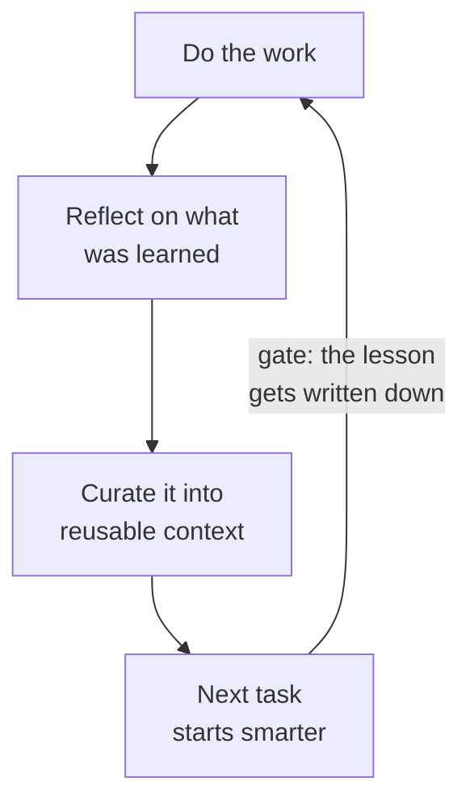

<!-- ACT 6 — LOCAL MODELS · ~8 min · 4 slides · live demo cap 3:00 -->
<!-- Ends on "The next problem", moved here from Act 5. It is the pivot into the close: -->
<!-- its last line hands straight to "What this does to you", which only works if nothing -->
<!-- follows it. Do NOT add slides after it. -->
<!-- Purely local models now. The counterweight moved to Act 7, where it belongs. -->
<!-- Directly answers the attendee-requested topics (Ollama, future of tech). -->
<!-- Open weights is motivated here rather than listed as an attribute back in Act 2. -->

# On your own machine

---

# Open weights, plainly

- Some models are a **service you rent**. You send text away; someone else's computer runs it.
- Some are **files you download** — a few gigabytes of numbers. Those numbers *are* the model.
- Those numbers have a name: the **weights**. Publish them for anyone to download and that's **open weights**.
- Not quite open source — licences vary — but the practical fact is the one that matters: you have the file.
- That's why running one at home is possible at all. Rented ones are stronger; downloaded ones are private and can't be taken away.

<!--
Somebody asked about running these locally, so let me do the one distinction that makes it make sense.

Some models are a service. You send your text to a company, their computers do the work, you get an answer back. Everything most people use is this.

Others are published as files. Genuinely just files — several gigabytes of numbers — that you download and run on your own machine.

Say the next bit slowly, because it is the only time all night I use the word. Those numbers are not a description of the model, they are the model; the whole thing is a very large pile of numbers and some arithmetic to run them through. The numbers are called the weights. When somebody publishes them for anyone to download, that is open weights. Not open source exactly — the licences vary and some are restrictive — but the practical fact is the one that matters: you have the file.

I deliberately did not explain weights earlier because you did not need them to understand anything up to this point. You need them now, and one sentence is the whole of it.

That is the entire reason local models exist. You cannot run a rented model at home because you were never given it.

Trade-offs are honest and simple. The rented ones are generally more capable, especially at the hard end. The downloaded ones are private — nothing leaves the room — free once you have them, work without internet, and cannot be discontinued, price-raised, or have their behaviour changed underneath you next Tuesday. For some jobs that matters more than raw capability.
-->

---

# On a machine in my house

- Not a data centre. No account, no subscription, nobody's API.
- The model is a file I downloaded. It runs on hardware I own.
- Which means nothing I type goes anywhere, and nobody can change it underneath me next Tuesday.

<!--
🔴 LIVE — Ollama on the Windows box over RDP · HARD CAP 3:00 · runbook in notes/demo-runbook.md

⚠️ Do NOT claim to be offline. The RDP session needs the network, so "watch me pull the wifi" is not available and would be a lie. The honest claim is ownership, not disconnection.

Say where you are: this is a desktop in my house, and I am looking at its screen from here. The model on it is a file I downloaded — seventeen gigabytes, about twenty-six billion numbers — and it is doing the work on that machine, not in anybody's data centre. Say the size out loud; it makes "a file you download" concrete in a way that "a local model" never does.

Ask it something ordinary. Let it be slower than the room expects and do not apologise for the wait; a machine in a spare room doing this at all is the point.

The argument to land while it generates: nothing I type leaves hardware I own. For anything genuinely confidential — medical, financial, legal, family — that property is the whole case, and it does not require trusting anyone's privacy policy. Worth adding that it also cannot be discontinued, price-raised, or quietly changed, which is a different kind of safety from privacy.

Be accurate about the quality. At 26B this answers an ordinary question about as well as a frontier model would, so do NOT claim it looks visibly weaker — on this kind of question it doesn't, and the room can see that. The honest line is that the gap opens on genuinely hard reasoning, not on everyday questions. Which is exactly what sets up the next slide.

Three minutes, then stop whatever is on screen.
-->

---

# When small is the right answer

- Cost, privacy, and speed all point the same way: smaller than you think.
- Frontier models for judgment and ambiguity. Small models for volume and well-specified work.
- **Best pattern going:** let the small model do it, and the big one check it.
- Keep it swappable — this changes every few months, so don't marry one.

<!--
So when is small actually right, beyond privacy.

More often than people assume. There is a reflex to reach for the most capable model for everything, and it is mostly wasted. Once a task is well specified and repetitive, a small model does it fine, faster and at a fraction of the cost — and cost stops being theoretical the moment you are running something thousands of times rather than chatting.

The pattern I keep coming back to, from an engineer at AWS who builds these systems: small model does the work, big model reviews it. You spend the expensive judgment only on judging, which is the part that needed it.

And build so you can swap. The specific best model right now will not be the best model in six months. Anyone who has hardwired themselves to one is going to have a bad time — including, and I mean this, in how you personally work. Do not get too attached.
-->

---
layout: two-cols
---

# The next problem

- Every skill and instruction file so far — **you** wrote it, by hand, when you happened to notice.
- So you capture the lessons you caught, on the days you had the patience. Nothing from the tasks you weren't watching.
- The open problem: **the system writing its own**, from watching itself work.
- Nobody has this solved. But the shape is already familiar.

::right::

<!--
Last one before I finish, and it is the honest "this is not finished" slide.

Some of you are already forming the objection, so let me say it for you: I told you the fix an hour ago. Write it down once, call it a skill, stop re-explaining yourself. That is real, and you should go and do it.

Here is the limit. Every one of those files exists because a person noticed something and stopped to write it down. So you capture the lessons you happened to catch, on the days you had the patience — and nothing at all from the tasks you were not watching. The writing down works fine. The noticing is what does not scale.

What is missing is the system doing it itself. Finishing a piece of work, looking back over how it actually went, pulling out what it learned, and folding that into the instructions for next time — with nobody sitting there authoring it.

That is genuinely the hard problem in this field right now and I am not going to pretend otherwise. I have spent a few months on it and what I have is a working sketch, not an answer.

Now point at the diagram, because this is my favourite fact in the talk. That shape is the same shape as the one from earlier, when I showed you how I learn a hard topic. Do the work, reflect on it, write down what changed, and only then advance.

They are the same loop. One is pointed at an agent and one is pointed at me — and I built the personal version in order to understand the agent version. The influence ran backwards.

If you take one structural idea out of tonight, it is that anything which improves — a person, a team, a piece of software — is running some version of this, and the step everyone skips is writing it down.

And that is also true of people. Which is where I want to finish.
-->
